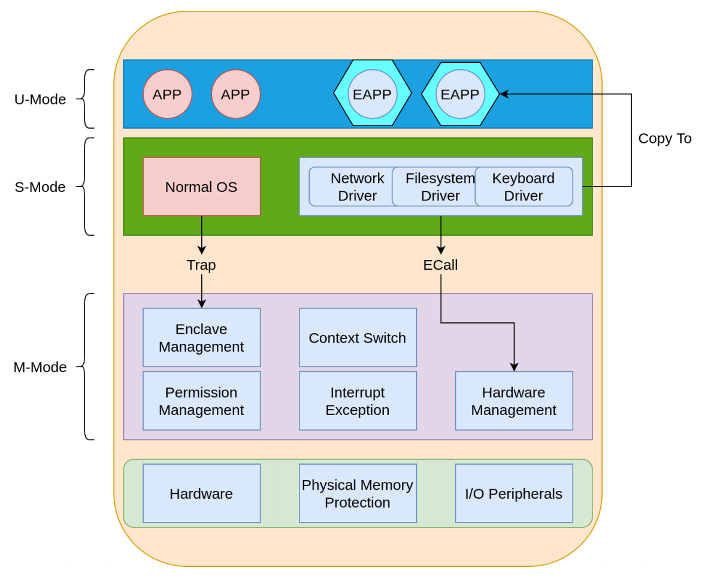

# Motivation

---

## State-of-the-art TEEs

- Intel SGX: fixed sized enclaves, no secure I/O, vulnerable to side-channel attacks

- Arm Trustzone: only one secure domain (the secure world)

- HECTOR-V: requires lots of hardware modifications

- Keystone: above issues are solved, but still with a high learning cost for developers

---

## Goal

- To provide a customizable, easy-to-use, side-channel free TEE fully implemented in software on RISC-V platform.

# Our Design

---

- Memory Protection: using RISC-V PMP scheme.

- Secure I/O: drivers are provided in unwritable flash, copy-on-need, avoiding privilege lifting. PMP could be used for permission management of peripherals.

- Customizability: user-defined permission management ---- whether to allow or to block an access request

- Side-channel free: adding randomness to the execution flow, no cache attacks

---

# Work Flow and Current State

---

- [x] Modify bootloader to initialize secure monitor

- [x] Create an enclave and run simple EAPPs

- [x] Implement simple drivers: console driver, RTC driver

- [x] Realize context switch between Linux and EAPP

- [x] Realize context switch between EAPPs

- [x] Build enclave manager, in charge of CRUD of enclaves

- [x] Build interrupt & exception manager

---

- [ ] Build permission manager, handle permissions of TEE/REE

- [ ] Scheduling EAPPs/OS

- [ ] More drivers

- [ ] Use Rust to ensure memory safety

- [ ] Formal verification of drivers, secure monitor and bootloader

- [ ] Plugin-like driver tree

- [ ] Protection against side-channel attacks

- [ ] Become a SBI extension (SecureSBI?)

# Current Problems

---

- Hard to design permission management scheme for multiply cores accessing one peripheral device
  
  - Maybe implementing a lock scheme