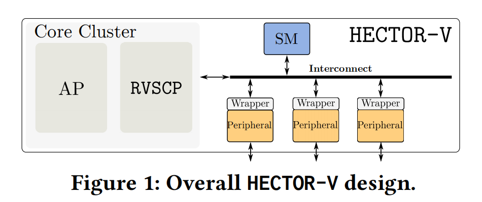
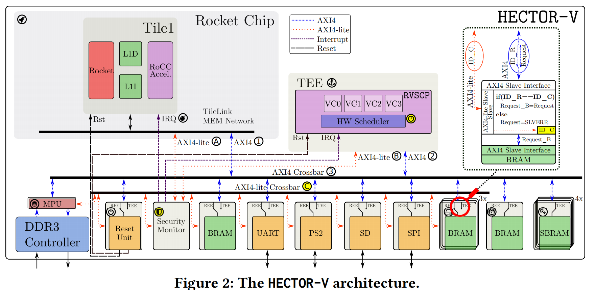
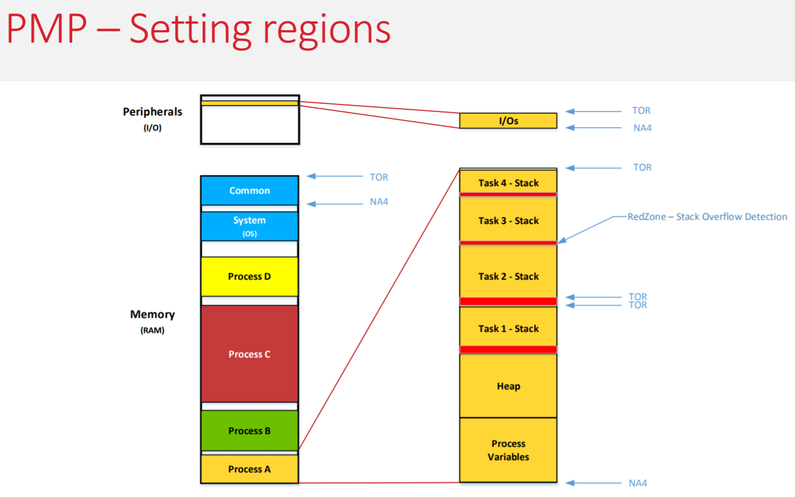
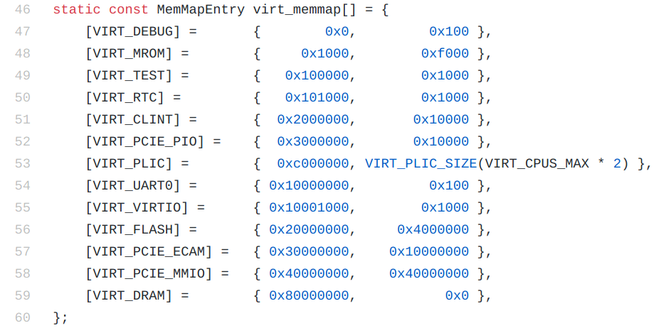

# Backgrounds

---

## About this paper

- Conference: ASIA CCS ’21 (16th), June 07–11, 2021, Hong Kong, China

- Author Information

(*Anonymous Author(s)* shown in the ASIA CCS preprint, but can be found on arXiv.)

[Pascal Nasahl](https://arxiv.org/search/cs?searchtype=author&query=Nasahl%2C+P), [Robert Schilling](https://arxiv.org/search/cs?searchtype=author&query=Schilling%2C+R), [Mario Werner](https://arxiv.org/search/cs?searchtype=author&query=Werner%2C+M), [Stefan Mangard](https://arxiv.org/search/cs?searchtype=author&query=Mangard%2C+S)

Graz University of Technology, Austria

(Prof. Mangard is one of the authors of *Meltdown*.)

---

## Existing TEEs

- Virtual Processor Based: Intel SGX, Arm Trustzone

### Pros and Cons

- Pros: high performance, no additional hardware
- Cons: cache/transient side channel attacks, no I/O protection

---

- External Co-Processor Based: Google Titan, Samsung eSE

### Pros and Cons

- Pros: cache/transient side channel attacks mitigated
- Cons: a communication interface required (which is typically slow and vulnerable to physical probing/sniffing attacks), addtional hardware required

---

- On-SoC Processor Based: Apple's SEP, Microsoft's Pluton, and HECTOR-V

### Pros and Cons

- Pros: fast secure commnunication channels, probing and sniffing attacks mitigated, cache/transient side channel mitigated
- Cons: additional hardware required

---

# HECTOR-V Design

---

## Threat Model

- a combination of bugs in kernel exists
- missing state-of-the-art protection strategies (ASLR, etc)
- bugs exist in the trustlets (can be exploited through the REE/TEE channel)
- cache/transient based side channel attacks
- malicious trustlets
- ...

### Sumary

Assuming a powerful attacker having full control over user app, OS, turstlets or even hypervisor running on the application processor.

---

## Goals

- Secure I/O
- Control-flow Integrity

To guarantee this two goals, a TEE is proposed with two key parts: a basic HECTOR-V and a RVSCP (RISCV Secure Co-Processor) extension (we will mainly discuss the extended architecture with both parts)

---

## Design

---

---

## HECTOR-V

- Peripheral Wrapper

Peripheral examples: SD-card controller, BRAM, UART, ...

The wrapper is designed for the security monitor to manage accesses to the peripherals.

- Security Monitor

The security monitor contains a table to manage peripherals.

- Security Monitor Owner

The entity that can configure the security monitor. The ownership can be transferred between the application processors and RVSCP virtualized processors.

- Interconnect

Use AMBA AXI4 and AXI4-lite protocols for communication between components of HECTOR-V. AXI4 is for data tranferring and AXI4-lite for configuration.

---

## How do the Trusted I/O Paths work?

### Identifier
The identifier consists of three parts:
- Core ID (1 bit)
- Process ID (4 bits)
- Peripheral ID (10 bits) 

Before accessing to a peripheral, the peripheral wrapper will check the ID of the request. The request is blocked if the ID does not match.

The Core ID is determined via hardware, which cannot be changed by softwares. The other two can be assigned by the security monitor.

The Peripheral ID is set to 0 if no protection is needed for the corresponding peripheral.

- How is ID transferred?

Using the user-defined signal in the AXI4 protocol (1024-bit long), there is no protocol overhead.

---

### Security Monitor
The security monitor maintains a table for peripheral management.

Supported commands:

- Claim
- Release
- Withdraw
- Transfer

---

- Claim

1. send a claim request to the security monitor
2. the security monitor checks whether the peripheral is unclaimed
	- unclaimed: check whether the requester is in the list of IDs that are permitted to access the peripheral. If not permitted, the request fails.
	- claimed: the security monitor notifies the requester. The requester needs to wait until the peripheral is released.

###  But wait...
What if someone launches a DoS attack?

---

- Release

This is done by set the ID field of the peripheral wrapper to 0.

- Withdraw

To solve the DoS problem, a withdraw scheme is provided. Any entity is capable of sending withdraw request to a specific peripheral, but needs to be approved by the secure monitor to be effective.

After withdraw command being approved:

1. set a timeout;
2. notify the current owner of the peripheral;
3. the owner of the peripheral shall *gracefully* release the ownership;
4. if the time runs out, the peripheral will be forced to be released.

---

- Transfer

### Who is to configure the security monitor?
The  *security monitor owner* shall define which peripherals can be claimed by which participants.

This ownership can be transferred between participants.

Example: from RVSCP in the TEE to the REE.

---

### Reset Unit
An entity similar to a peripheral. Can be used to turn on and off other entity.

### Secure Storage
To securely store sensitive data: crypto-keys, biometric data, user passwords, ...

This is a speical peripheral with a predefined, immutable ID consisting of the core ID and the process ID assigned at design time.

---

## Big Problem

**Physical Memory Protection** or **Physical Address Protection** ?

This picture is from one of the talks found at riscv.org: [Using the RISC-V PMP with an Embedded RTOS to Achieve Process Separation and Isolation](https://riscv.org/wp-content/uploads/2018/12/Using-the-RISC-V-PMP-with-an-Embedded-RTOS-to-Achieve-Process-Separation-and-Isolation-Labrosse.pdf), which shows that peripherals are under protection from PMP (TOR and NA4 are two address modes of PMP).

Video can be found here: https://www.youtube.com/watch?v=upkZZldpljA

---

---

---

## RVSCP

### Key Feature
- Hardware implemented system functioning: multi-task, virtualized processors, hardware-context-switch
- **Control-Flow Integrity**.

---

- Virtualized processors

Each corresponses to a process ID, which enables peripheral access management between trustlets.

### Where to store the context during the context switch?
- Option 1: add four addtional register sets
- Option 2: use the secure storage mentioned before

---

- Code storage

To use one of the virtual cores, the code must be fetched from a specific BRAM.

- Four BRAMs for code storage.
	- One binded to VC0 permanently
	- Three being claimable

---

## Control-Flow Integrity

CFI is accomplished via *Sponge-Based Control-Flow Protection* (SCFP).

- Encrypted at compile time
- Instruction by instruction decrypted at runtime
- The decryption depends on the historic execution
- (!) Use *patches* to make sure the encryption converges for different execution paths

This sounds like magic. Take-home messages:

- once the control-flow is changed, the decryption result seems meaningless
- ROP attacks mitigated
- source code required
- works well for small-sized codes
- the SCFP state and the decryption key should be stored during context switch 

Ref: [*Sponge-Based Control-Flow Protection for IoT Devices. EuroS&P. 2018. Werner, et al*](https://arxiv.org/pdf/1802.06691.pdf)

---

### CFI with secure I/O
The SCFP state is compressed into a 10-bit code used as the peripheral ID field in the AXI4 user signal. This guarantees that only when the program execution runs into some specific state may the process access the peripheral.

---

---

## Example: Secure Boot

1. Initially, VC0 is the security monitor owner
2. The reset unit is set to release the reset line of RVSCP while REE processor halted
3. Applying power to the device and VC0 starts to execute the ZSBL (zero stage bootloader) stored in the secure code storage (ZSBL as the system root-of-trust)
4. ZSBL claims the SD-card controller and configures the memory protection unit of DDR3
5. ZSBL fetches the BBL from the SD card and then stores it into the memory
6. ZSBL computes the hash value of the loaded BBL image and check it with the one stored in the secure storage element of VC0

---

7. If the verification is successful, ZSBL releases the SD-card driver, gives the main app processor access to DDR3 by configuring the MPU
8. ZSBL triggers the reset unit to start REE and BBL starts to be executed by the Rocket Chip
9. BBL requests access to the SD-card controller, then loads the Linux image
10. Do another hash check for the Linux image (Where is this hash stored?)
11. Linux booted and it claim the first peripherals by sending requests to the security monitor

---

# Inspiration

---

- How does PMP work in RISC-V?
- Can we borrow the scheme of their security monitor for managing peripherals? (Different processes cooperates on a same device)
- Verification of image at boot time?

---

## Last Week Accomplishment

- Learned about SPI, I2C protocol and their different to UART. However, after checking qemu source code, there is no GPIO pins provided by qemu. (Check the figure in the following slide: https://github.com/qemu/qemu/blob/master/hw/riscv/virt.c)
- Nevertheless, RTC is provided:
	- Implemented an RTC driver
	- Provided a standard gettimeofday() syscall
- Prepare for the paper discussion

---

---

## Next Week Plan

- Comfirm whether PMP machanism works as we thought
- Learn about FPGA and starts to try to transfer to real board 